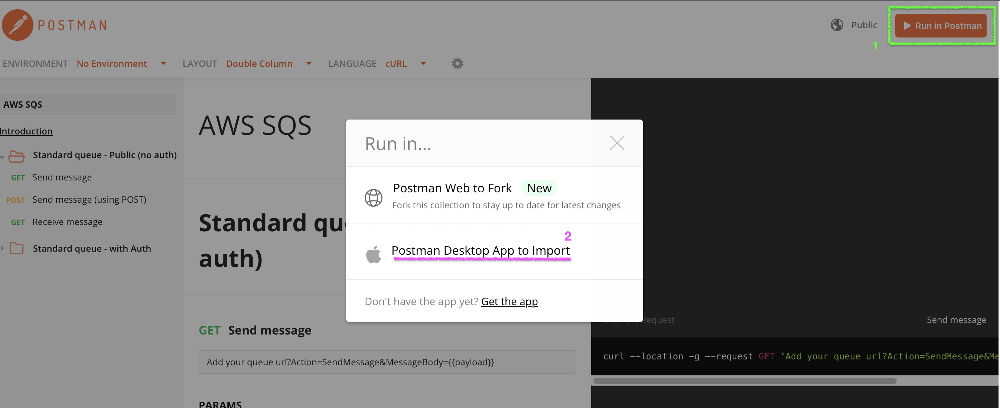
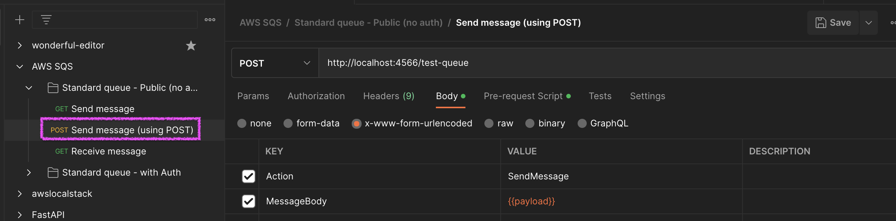
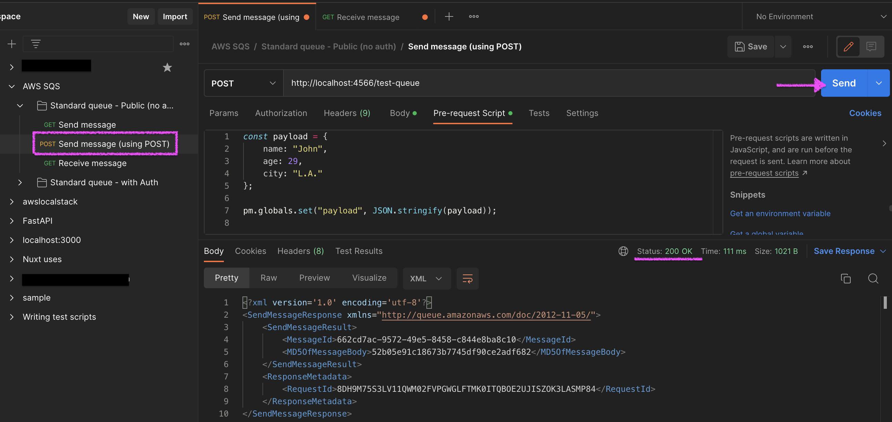
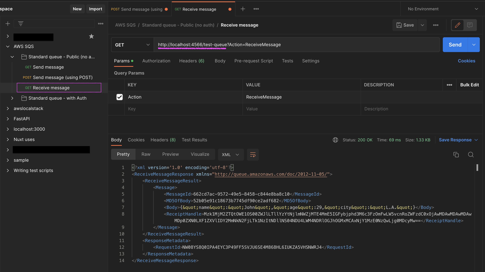

## Introduction

Leave a note on how to use Postman to manipulate SQS.
The advantage is that you don't have to repeatedly hit curl commands or aws CLI commands/

## SetUP Docker Container

1. Accessing docker containers
    ```bash
    docker exec -it localstack_main bash
    ```

2. Create queue
    ```bash
    $ awslocal sqs  create-queue --queue-name test-queue
    {
        "QueueUrl": "http://localhost:4566/000000000000/test-queue"
    }
    ```

3. Send queue message
    ```bash
    $ awslocal sqs send-message --queue-url http://localhost:4566/000000000000/test-queue --message-body tes
    {
        "MD5OfMessageBody": "098f6bcd4621d373cade4e832627b4f6",
        "MessageId": "9000f162-54b9-4b66-af7f-c69c51db959b"
    }
    ```

4. Receive queue message
    ```bash
    $ awslocal sqs receive-message --queue-url http://localhost:4566/000000000000/test-queue
    {
        "Messages": [
            {
                "MessageId": "9000f162-54b9-4b66-af7f-c69c51db959b",
                "ReceiptHandle": "NjZjMjI4NDUtZjg5NC00ZmMxLTlhNTEtZGIzODQzYzE0ZTIyIGFybjphd3M6c3FzOmFwLW5vcnRoZWFzdC0xOjAwMDAwMDAwMDAwMDp0ZXN0LXF1ZXVlIDkwMDBmMTYyLTU0YjktNGI2Ni1hZjdmLWM2OWM1MWRiOTU5YiAxNjY1Mjg0Mjc1LjYyODk2NzU=",
                "MD5OfBody": "098f6bcd4621d373cade4e832627b4f6",
                "Body": "test"
            }
        ]
    }
    ```

## Postman Procedure

1. import Postman DeskTop version from [Postman AWS SQS](https://documenter.getpostman.com/view/2631434/SWLh56pX)
  

2. reflect the `queue-url` of the localstack you created and check the contents of the Body
  

3. Confirm that the `Pre-request Script` contains a sample, and click `Send`.
  

4. reflect the `queue-url` and perform the receive process, you can confirm that the content of the Send Message is received.
  
